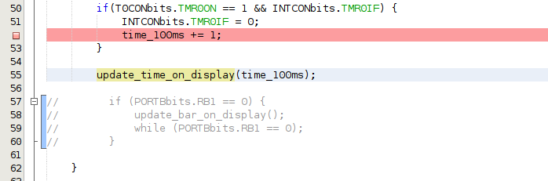

# Lab3 Timers
In this laboratory we will do some excercises on timers and deepen our understanding about their advantages against "time wasting" loops.
As always, please first clone this repository and open the contained project in MPLAB.
> [!TIP]
> In case you need the manual for Git again, click [here](https://github.com/MicrocontrollerApplications/Utilities/blob/main/git.md)
> If you need the development board's schematic, click [here](https://raw.githubusercontent.com/MicrocontrollerApplications/Lab2_InputOutput/refs/heads/main/images/uCquick_Board_2018_01.svg)

## Relevant registers
For today's laboratory we will need the previously used regsiters to configure our I/O pins and the registers introduced in the lecture. All those regsters are listed below. Please check them to ensure you are aware of all relevant registers for today.
> [!NOTE]
> ### I/O
> **TRISB** sets the direction of a pin: "0" = output, "1" = input<br>
> **PORTB** reads the logic level at the pin: "0" = 0-0.8 V, "1" = Vdd (1.6-3.3 V or 2.0-5.0 V for TTL inputs)<br>
> **LATB** set the output voltage of a pin: "0" = 0 V, "1" = Vdd (3.3 V or 5 V)<br>
> **ANSELB** sets a pin as digital or analog: "0" = digital, "1" = analog<br>
> **OSCCON** sets the oscillator freq.: 0x50 = 4 MHz, 0x30 = 1 MHz. The instruction freq. are 1 MHz and 250 kHz respectively<br>
> **\<Register\>bits.X** TRISBbits.TRISB3 or LATBbits.LATB3 or PORTBbits.RB3 is the direct access to the bit 3 via a struct (see structures in C).
> ### Timer X
> **TxCON** to configure Timerx (today x will be 0 and 1)<br>
> **TMRx\<H/L\>** to set the timer to a given (initial) value<br>
> **INTCON** to check Timer0's interrupt (i.e. overflow) flag<br>
> ### Capture Compare Module
> **CCPxCON** configure the Capture Compare Module<br>
> **CCPx\<H/L\>** set comparison value for comparison mode of Capture Compare Module<br>
> **CCPTMRS0** set timer to be compared with CCPx<H/L><br>
> **PIR1** to check Capture Compare Module's interrupt flag<br>

## Relevant Chapters of the datasheet
For this laboratory we will use the microcontroller's datasheet (Excercise 2) for the first time. You can find the latest version of the datasheet [here](https://ww1.microchip.com/downloads/aemDocuments/documents/MCU08/ProductDocuments/DataSheets/PIC18%28L%29F2X-4XK22-Data-Sheet-40001412H.pdf).
The relevant chapters for today's laboratory are
- 11.0 TIMER0 MODULE
- 12.0 TIMER1/3/5 MODULE WITH GATE CONTROL
- 14.0 CAPTURE/COMPARE/PWM MODULES

> [!TIP]
> We will use the datasheet in every laboratory session from now on. Thus, it's a good idea to either bookmark the datasheet in your browser or to download it to you machine.
> Furthermore, you should get used to the datasheet as you will need it to get the relevant information and for the final **exam**! Thus, it's better to not take any shortcuts and really read the datasheet. ;)
> Nevertheless, you can of course use the search functionality within the datasheet. Within the exam you will get a thinned out version of the datasheet with all relevant modules. So you don't need to extensively train searching the (printed) datasheet, but it's beneficial to be used to the module's descriptions.

## Excercise 1 - Code analysis
### Question 1.1
As usual, please analyse the code first and describe it with your own words. Keywords for today's analysis (that should be used) are as follows.
- waiting loop
- function call
- status check (e.g. for external signals)
- interrupt (or overflow) flags

Answer yourself the following questions:
1. how much time (in milliseconds) will the for-loop in line 43 waste?
2. what's the purpose of the if-statements in line 41 and 50?
3. what happens if TM gets pressed?
4. How is Timer0 configured?

If you think to that you understood the code, proceed with the next excercise. Keep in mind, that the whole main-file will be part of the voting. So maybe use the possibility to ask for help.

### Question 1.2
Now we want to test our code, to see what's the difference between the two timing approaches (for-loop and a timer) have.
First, we want to let our code run and see what it does. So, let's start by clicking on the Debug-Button. As soon as you see any changes on the display you can start pressing the middle-button.
> [!IMPORTANT]
> Use different frequencys (slow and fast) to press the button. Otherwise you will not see the difference between using a timer and a time wasting for-loop.
Use your mobile phones stopwatch to check the correctness of the timing. As stopping one second exactly is hard, stop 5 to seconds to reduce the measurement error's impact.

When you're finished with this, and observed any strange behaviour, stop the program. It's time to use the timer. Therefore, go to line 82 and change the value of *T0CONbits.TMR0ON* from 0 (zero) to 1 (one).
```C
T0CONbits.TMR0ON = 1;
```
After enabling Timer0 start your program again by clicking the Debug-Button and press the middle-button again if the clock starts to run on the display. Use different frequencies for pressing the button again. Can you observe a different behaviour to the one before?

### Question 1.3
Now that we know the specialities of the current implementation it's time to check where they come from. Therefore, we change the configuration from PicKIT3 to Simulator.
We will now check the timing of our two approaches as well as the overall timing, to ensure everything is timed as expected.
First, we will check the approach using a timer.
> [!CAUTION]
> As the missing external input led to problems in the past we will comment the part of the code checking the middle-button's state. Thus, please comment lines 57 to 60.
> 

> [!IMPORTANT]
> Before checking the timing via the stopwatch, calculate the expected time first!

To check the timing of the timer we will disable the display output by commenting line 55 and set a breakpoint in line 52.<br>


Now we can open the stopwatch (Window -> Debugging -> Stopwatch) and start Debugging.

If the Debugger stops at line 55 for the first time, open the stopwatch tab and click continue (or press F5). How long did it take to get to the breakpoint again? Is it the time you expected?

Now that we know how our timer performs without updating the display we will check how much time it needs with the additional update of the display. Thus, stop the debugging session, uncomment line 55 and repeat the previous procedure.<br>


Did you spot any difference? If so, try to find the reason for it.

Let's see if the time wasting for-loop behaves the same way as the timer. Disable the timer (line 82) and set a breakpoint to line 43 and 47.<br>


Start debugging and remove the breakpoint in line 43 if it's reached for the first time. Now open the stopwatch tab again and continue code execution. Does the time of the for loop differ from the timer's one? If so, can you explain why?
Now, remove the breakpoint in line 47 and add a breakpoint in line 55.<br>


Continue code execution and wait for the new breakpoint to be reached. Afterwards, continue code execution again to stop the time needed for a complete cycle of updating the display and waiting the required 100ms. Can you see a difference to the approach using a timer? If so, what's the reason for it?

## Excercise 2 - Improve Timer usage
Now as we know the differences between using timers and time wasting for-loops we should remove the disadvantage that the timer needs to overflow and thus does not offer the ability to finetune its timing. Therefore, we will use the Capture Compare Module of our Microcontroller.
But first, let's get rid of the time wasting for-loop (you should already have learned that they have huge disadvantages ;) ). You can either delete it from the source code or comment the relevant lines.
### Question 2.1
As Timer 0 sadly cannot be used with the Capture Compare Module we need to configure Timer1. Therefore, add the relevant configuration to the __init() function below Timer0's configuration. You can use the configuration of Timer0 as an orientation, but keep in mind that Timer1 uses 16 bit by default.
Check the datasheet to implement below listed configuration. Your configuration needs to enable Timer1 to run for **at least** 100ms, it's also sufficient if it could run longer before an overflow.
1. Clock selection shall be set to $\frac{F_{osc}}{4}$.
2. TMR1L and TMR1H shall be set to 0. **Keep in mind that the order of writing those two registers matters!**
3. Prescaler needs to be chosen by you. Check the prescaler values 1, 2, 4, and 8 for their usability. Maybe more than one can be used?
4. Enable Timer 1.

After you configured Timer1, the Capture Compare Module needs to be configured, too.
Before checking its description in the manual, please check [uC Quick](https://fs.hs-ulm.de/org/Institute/IMM/INFO/LIB/uC_LIB/uC_Quick/uCquick-X.pdf)'s short summation of this module, which can be found in chapter  *1.2.6.4 Capture/Compare/PWM Modul (CCP)*. 
> [!NOTE]
> The summation is written german. As an english version does not exist, please use Google Translator, Deepl.org, ChatGPT or another translation tool of you choice to translate the text into your preferede language.

> [!TIP]
> In case your browser / PDF reader does not provide you a table of content for the document use *STRG + F* to find the chapter.

Open the documentation of the Capture Compare Module and implement below configuration for CCP1.
1. Set the Mode Selection to *Compare Mode: Special Event Trigger*. (CCPxCON -> CCPxM)
2. Select Timer1 for comparison. (CCPTMRS0 -> C1TSEL)
3. set the comparison value depending on the prescaler you chose for Timer1. You need to calculate that value, convert it to hexadecimal and set CCPR1H and CCPR1L accordingly.
4. Set *PIR1bits.CCP1IF* to zero, to avoid a flase initial notification.

To use Timer1 and the Capture Compare Module within th eapplication we need to add it to the main function now.
Therefore, use below boiler code and fill in the gaps.
```C
if (/*which flag needs to be checked here, to react on a notifiction of CCP1?*/){
  // reset the just checked flag
  // do we need to something in addition, to increase our timer on the display?
}
```
If you think that you implemented the required functionality, change the configuration back to ***PicKIT3***, remove all leftover breakpoints and uncomment lines 57 to 60. 
Now click on the debug-button and check if your code is working as expected. If not, find the error and fix it. :)
> [!NOTE]
> Don't forget to check the button's functionality, too.

### Question 2.2 - Ensure timing works as expected
Now that we're using Timer1 and the Capture Compare Module, we should check if the timing was improved compared to the approach using Timer0.
Therefore, we go back to the Simulator (change configuration accordingly, and comment the lines checking the middle button's state).


To check the new approach we will repeat the procedure of [Question 1.3](#question-1-3).
1. disable the display output (comment line 63). 

2. set a breakpoint whereever you increase the variable *time_100ms* after checking PIR1bits.CCP1IF.
3. check the time between two consecutive stops at that line. Is it more accurate than before?
4. last but not least enable the display output again and repeat the previous check. Is everything working correctly?

## Excercise 3 - For experts (not part of the votation)
As we are now used to using timers, we could use two of them in parallel. Therefore, Timer0 shall be used to let an LED (you decision which one) blink in a given frequency (don't try to fine tune the frequency, just use one that's simple to achieve) and Timer1 should let another LED blink in a different frequency. You can keep the timer on the display running, but then you need to configure Timer1 and CCP1 in a way that it maintains time steps of x*100ms (i.e. 100, 200, 300, ..., 1100, 1200, ... ms). Feel free to play around with the Timing in order to get used to the necessary calculation. Use the Simulator as done before to check you implementation.
Keep in mind that the I/O pins need to be configured correctly, in order to use the LEDs. ;)
